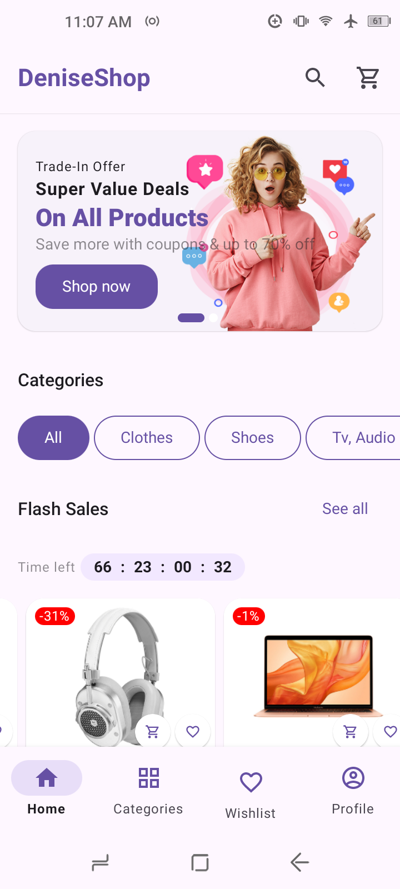
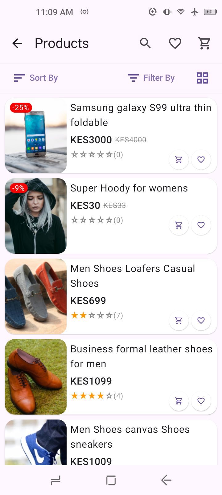
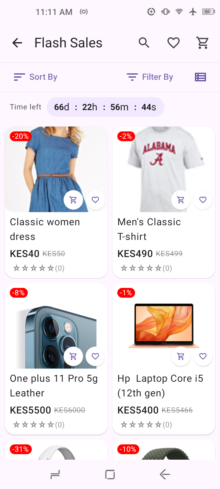
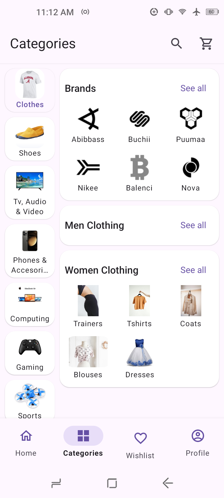
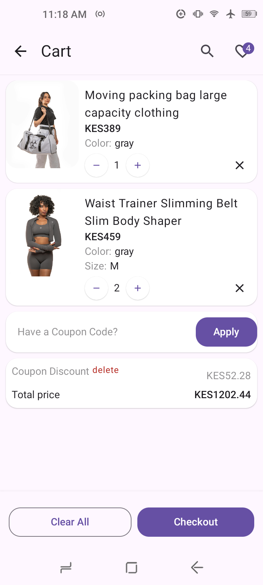
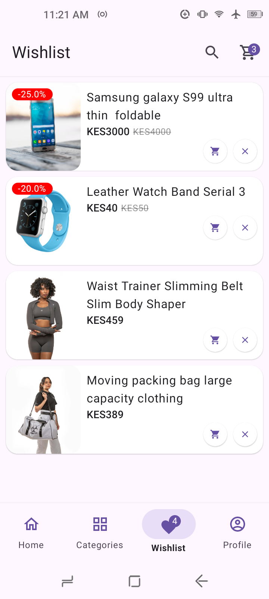
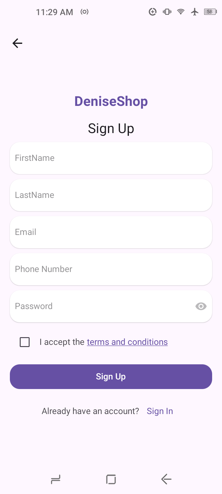
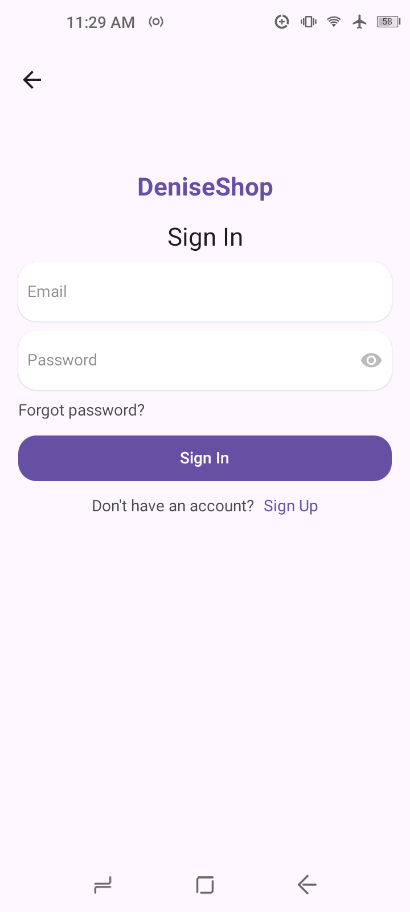
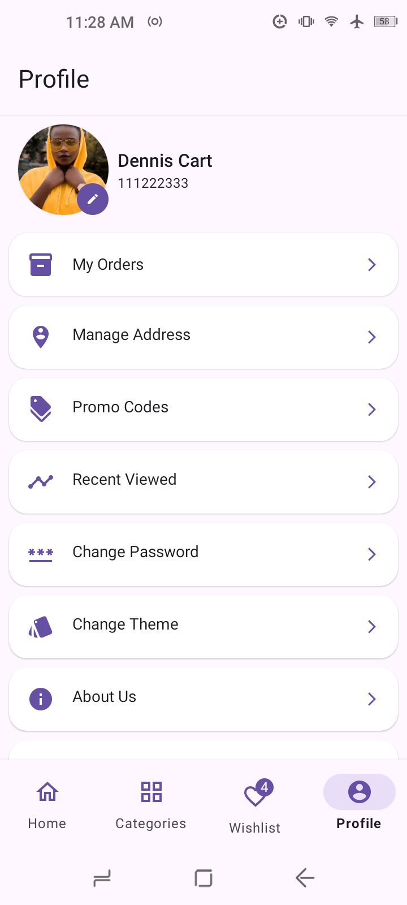

# Deniseshop E-commerce App

[](https://kotlinlang.org)
[](https://developer.android.com/jetpack/compose)
[](LICENSE)

Modern e-commerce Android application built with Kotlin, Jetpack Compose, and modern Android architecture components. Features a clean architecture.

## Key Features

**Core Functionality:**
- User authentication (Login/Register/Forgot Password)
- Product browsing & search
- Categories functionality
- Shopping cart management
- Wishlist functionality
- Order functionality
- Coupon code redemption
- Address management
- Brand exploration

## Tech Stack and Libraries

**Architecture:**
- Clean Architecture (Data ➔ Domain ➔ Presentation)
- MVVM and MVI Pattern
- Repository pattern
- Use Cases (Business Logic Separation)

**Libraries:**
- 🖼️ **UI**: Jetpack Compose, Material3
- 📡 **Networking**: Retrofit 2, OkHttp3
- 💉 **DI**: Dagger Hilt
- 🔄 **Async**: Kotlin Coroutines, Flow
- 🖼️ **Image Loading**: Coil
- � **Navigation**: Nav3 (type safe)
- 📦 **Persistence**: DataStore

## Installation

**Prerequisites:**
- Android Studio Otter | 2025.2.2 or later
- Android SDK 36
- Java 17

**Steps:**
1. Clone the repository:
   ```bash
   git clone https://github.com/dennis-o-a/deniseshop.git
   ```
2. Open project in Android Studio
3. Build project (will resolve Gradle dependencies)
4. Run on emulator or physical device (min API 24)

## Screenshots

| Home                                      | Products                              | Flash Sales                                 |
|-------------------------------------------|---------------------------------------|---------------------------------------------|
|       |  |  |
| Categories                                | Cart                                  | Wishlist                                    |
|  |          |        |
| Register                                  | Login                                 | Profile                                     |
|      |        |          |


## Backend

The Deniseshop App uses the [Deniseshop Web App](https://github.com/dennis-o-a/deniseshop-web-app.git) for RESTful api.</br>


## Security

- 🔒 JWT Authentication with refresh token flow
- 🔄 Secure token refresh mechanism
- 🚫 SSL certificate validation

## Contributing

1. Fork the project
2. Create your feature branch (`git checkout -b feature/AmazingFeature`)
3. Commit changes (`git commit -m 'Add some AmazingFeature'`)
4. Push to branch (`git push origin feature/AmazingFeature`)
5. Open a Pull Request

## License

Distributed under the MIT License. See [LICENSE](LICENSE) for more information.

## Acknowledgments

- Jetpack Compose Team
- Android Developers Community
- Retrofit & OkHttp Maintainers
- Dagger Hilt Team
- Coil Image Loading Library


